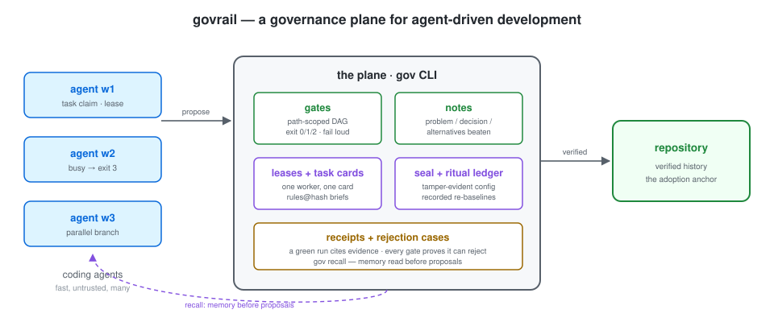
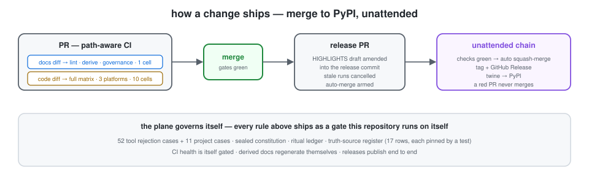

# govrail

English | [中文](README.zh.md)

[](https://github.com/Lixiang9716/govrail/actions/workflows/ci.yml)
[](https://pypi.org/project/govrail/)
[](https://pypi.org/project/govrail/)
[](https://github.com/Lixiang9716/govrail/stargazers)

<p align="center"></p>

A governance plane for agent-driven development: coding agents work fast
in parallel while machines — not vigilance — hold the quality line. The
governance machinery (gates, notes, receipts, pairing) is language-agnostic;
the code-facts layer runs on the eight tree-sitter grammars shipped today
(c, cpp, go, java, javascript, python, rust, typescript — add more rules
via `.gov/checks/<lang>.json` the same way). The runtime is Python 3
(>= 3.10) — all installed by `pip install govrail`, no other tooling
required.

The plane ships two mechanisms: **gates** (any promise a command can check
becomes a mechanical check) and **notes** (every non-trivial change records the
decision, what it beat, and the consequences). Bilingual pairing keeps the
external-presentation docs in sync.



## What it changes

| Without govrail | With govrail |
|---|---|
| Agents follow rules "on their honor"; nothing is enforced | Every checkable promise is a gate that fails loud |
| "Why did we do this?" is lost or re-litigated | Each decision is a note with the alternatives it beat |
| Adopting tooling means a restructure or a new runtime | One command, zero restructure: `gov init` |

See a governed project in [examples/demo-project](examples/demo-project) — a living specimen exercising every feature (rubric, rejection cases,
surfaces, decisions). Task-oriented recipes: [docs/cookbook.md](docs/cookbook.md).

## How a change ships



Rule 1 in motion: the smallest sufficient set runs per diff (a prose
edit never pays the platform matrix), CI owns the full matrix, and
releases are batched — the release PR accumulates release-worthy
changes, and squash-merging it cuts the release: draft amended into the
release commit, tag and PyPI unattended per cut (D66). A red PR
never merges; the chain halts on evidence, not on hope.

## Install

```sh
pip install govrail        # or: uv tool install govrail / pipx install govrail
```

On a lagging pip mirror the wheel can be missing while `pip index versions`
already lists it (the JSON API updates before the simple index). Install
from the official index then: `pip install govrail --index-url https://pypi.org/simple`.

This puts the `gov` CLI on your PATH (Python + tree-sitter, nothing
else). It has one subcommand per action:

```sh
gov init --project <path>     # inject the plane into an existing project
gov init --project <path> --upgrade  # show template drift (diffs, never writes)
gov init --project <path> --adopt all  # land missing template files (never overwrites)
gov init --project <path> --adopt-new gates.json  # merge new shipped gates into a customized gates.json
gov preset list                # shipped presets (D53): agent-heavy, python-lib,
                               #  docs-bilingual — typed adoption bundles
gov preset show python-lib     # read-only: exactly what a preset lands
gov preset apply docs-bilingual --project <path>  # land its gates + skills + hints,
                               #  additive and idempotent (never overwrites)
gov init --project <path> --preset agent-heavy  # init, then apply the preset in one command
gov doctor                     # environment self-check (PATH, python, parse layer, hooks, schema, unadopted gates)
gov doctor --json             # machine-readable: {status, checks, problems}
gov note new --class process --ref D6 "Title"  # scaffold a note, pre-validated
gov init --project <path> --hooks --ci  # also install a pre-push hook and CI
gov agent-hooks <event>                  # agent lifecycle hooks (session-start/pre-tool-use/post-tool-use/user-prompt-submit/stop): context
                               #  injection + a small configurable deny set (.gov/hook-deny.json) + an advisory on stop;
                               #  wired dialects: claude/codex/copilot/gemini — other hosts and MCP are out of scope
gov uninstall --project <path>  # reverse it exactly
gov run                        # run the default mode's gate DAG (defaultMode)
gov run --base HEAD~1          # only the gates whose paths match the diff
gov run --merge a b --base origin/master  # preflight the union of parallel branches:
                               #  merge each into a scratch worktree, gates run on every
                               #  step's tree; conflict or red step keeps the scene (D51)
gov run --gate pairing         # rerun a single gate
gov self-test                  # rejection cases: the tools' + yours (.gov/rejections/)
gov run --json                 # machine-readable: [{gate, outcome, duration_ms, detail,
                               #  selected_by, scoped_out, ...}] — the whole gate set, incl. scoped-out
gov verify pairing --write    # re-confirm a bilingual pair after editing one side
                              #   (names the field values it wrote; the record's
                              #    comments state the field semantics — #150)
gov verify pairing --write en:docs/a.md zh:docs/a_CN.md  # register any naming
gov verify pairing --explain  # the record schema + conventions, read-only
gov note presence      # warn when a non-trivial diff carries no Agent Note
                              #   (task receipts exempt; manifest note_presence_exempt names more)
gov verify rubric             # check the review rubric's structure
gov decision verify          # guard the decisions table (ids, alternatives)
gov decision verify --base <ref>  # + parallel-branch number collisions
gov decision verify --json    # machine-readable: {violations, orphans, overdue, ...}
gov decision next --base <ref>     # next free D-number (branch-aware; warns on a stale base)
gov decision add --from FILE       # append a decision, validated + atomic (--against = --base)
gov verify conflict-markers   # fail when changed files carry git conflict markers
gov review --base <ref> --grade  # dossier + interactive rubric grading
gov trend                     # gate duration trends from --record history
gov stats                     # structural facts per language (lines, symbols, nesting depth) — facts, not verdicts
gov parse <files>             # per-file function spans, line counts, depth (--json);
                              # govrail ships the tree-sitter stack — custom gates may
                              # import it, never pin tree-sitter yourself.
                              # shipped grammars: c, cpp, go, java, javascript,
                              # python, rust, typescript
gov check                     # syntax-class checks over the parse layer; suppressions counted, never invisible;
                              #  SKIP(nolang) names source files no rule can judge (#308)
gov receipt verify <commit>   # was a full green run recorded on this tree? (#124)
gov receipt show --markdown   # render receipts for a PR comment / CI job summary (#313)
gov gate add tests --paths 'tests/**' -- pytest -q  # wire a product gate, validated + verified (#309)
gov recall <terms>            # retrieve notes, decisions, postmortems (--any relaxes the AND)
gov note audit               # staleness signals in implemented notes
gov note audit --json         # machine-readable: {findings: [{file, signal}], ...}
gov change-scope --base <ref> # smallest sufficient set (.gov/surfaces.json maps paths)
gov task new "Title" --check "criterion"  # task card: one-line rules@<hash> pin for a subagent brief
gov task check                 # after a rules adoption: name the stale cards
                               #  (one line per card; --verbose keeps void reasons)
gov task tick T-0001 1         # tick checklist item 1 (canonical "[x] "); hand-editing card JSON is never OK
gov task show T-0001           # render a card whole: checklist, void reason, receipt
gov task claim T-0001 --agent w1 --ttl 20m  # lease an open card for one worker
                                            # (two workers cannot take one; busy → exit 3)
gov task release T-0001 --agent w1          # release the card lease you hold
gov task close T-0001          # run the gates; the green run becomes the completion receipt
gov task list --json           # cards as [{id, title, status, rules, claim}] — claim read
                               #  from the lease file; expired reads as unclaimed
gov lease acquire reports/summary.md --agent w1  # lease a shared resource (busy → exit 3;
                                           #  --wait S polls, --ttl S bounds the lease;
                                           #  both outcomes announce the lock root)
gov lease release reports/summary.md --agent w1  # release a lease you hold (never on another
                                           #  holder's behalf)
gov lease list                      # list current leases (diagnostic only)
```

The full command surface, verbatim from `gov --help`:

<!-- gov:commands BEGIN — generated from `gov --help` by scripts/update_readme_commands.py (regenerate: python3 scripts/derive_all.py); never edit by hand — drift is caught by tests/test_docs_cli_consistency.py -->
```text
commands:
  init             inject the plane into a project (--hooks/--ci add runners; --hooks --pre-commit adds the opt-in commit-stage gates; --adopt-new merges new shipped gates; --upgrade shows template drift; installs .claude/settings.json agent hooks unless one exists)
  uninstall        reverse init
  run              run the project's gate DAG (args forwarded to gates.py; --receipt records a tamper-evident run receipt, #124; --merge preflights the union of parallel branches in a scratch worktree before landing)
  gate             gate-set surgery (add): wire a product gate into gates.json with schema validation and a verification run — no hand-edited JSON (#309)
  self-test        run governance rejection cases
  receipt          verifiable run receipts (verify/show): verify a cited receipt against a commit (issue #124/D42)
  agent-hooks      agent lifecycle hooks (session-start/pre-tool-use/post-tool-use/user-prompt-submit/stop — context injection, a configurable deny set, an advisory on stop; a presence, not the enforcement; claude/codex/copilot/gemini dialects)
  verify-plane     tamper-evidence for the plane's own config (rules.md, gates.json, pairing/decisions/surfaces, .gov/rejections/**; --write re-baselines — interactive consent, --confirm-unattended for agents)
  hooks            git-hook gate runners (the installed hooks delegate here; 'hooks pre-commit' runs the gates whose 'stages' include 'pre-commit' under their configured advisory/blocking contract)
  doctor           environment self-check (PATH, python, hooks, gates schema)
  note             note scaffold, read side, and the notes gates (new/check/list/show/verify/presence/audit/archive/archive-verify; list --stale marks audit signals)
  decision         decision-row tooling (next/add/verify: next free D-number; atomic validated add; table structure guard)
  lease            lease locks for parallel agents (acquire/release/list; busy exits 3; --wait S polls, --ttl S bounds the lease)
  verify           content gates without a family hub (pairing/rubric/conflict-markers/doc-sync)
  check            syntax-class static checks over the parse layer (shipped + .gov/checks/ rules; suppressions counted; --strict makes warnings block)
  parse            per-file structure facts from the parse layer (function spans, line counts, nesting depth) — facts, not verdicts; the primitive a size/complexity gate reads (#265)
  review           assemble the review dossier for a diff (scope, notes, recall, rubric)
  trend            gate duration trends from .gov/history/ (p50 per window; --by-tag splits per caller, --cost rolls up caller-reported cost)
  stats            structural facts per language (lines, symbols, nesting depth) from the parse layer — facts, not verdicts; --record appends to the stats ledger
  whatsnew         usage-oriented highlights since a version
  recall           retrieve notes, decisions, and postmortems (all terms, ranked)
  change-scope     report touched surfaces (e.g. --base <ref>)
  surprise         the surprise ledger (record/list): expectation vs reality, counted per signature; rule 11 — the third occurrence of a signature escalates into a process improvement
  task             task cards for subagent briefs (new/check/tick/show/close/claim/release/list/void; rules@hash pin + checklist + green-run receipt; tick is how the checklist gets ticked, claim/release lease a card so two workers cannot take one)
  preset           typed adoption bundles (list/show/apply): a project type's gates, skills, and manifest hints — additive, never overwriting (D53)
  update           one deliberate migration step: adopt missing/moved templates, merge newly shipped gates, refresh the CI pin, re-seal the plane (dry run by default; --apply executes; the seal needs --confirm-unattended or a TTY)
```
<!-- gov:commands END -->

The full command surface, verbatim from `gov --help`:


The full command surface, verbatim from `gov --help`:


The full command surface, verbatim from `gov --help`:


The full command surface, verbatim from `gov --help`:


The full command surface, verbatim from `gov --help`:


`init` is non-invasive and idempotent: it creates `.gov/rules.md`, adds
`gates.json`, the notes README, and the agent skills (recall-first,
pre-push-checks, code-review, archive-agent-notes) only when missing,
appends one reference line to AGENTS.md, and never overwrites the
project's own files — including its own skills. `--hooks`/`--ci` can be
retrofitted later (`gov init --hooks` on an initialized project installs
just the add-on; customizations stay untouched); `--hooks --pre-commit`
additionally installs the optional pre-commit hook — the cheap content
gates (pairing sidecar freshness, conflict markers) on the staged files,
so pair drift surfaces at `git commit` with the scoped fix command
inline instead of one stage later at push (#110). `uninstall` reverses
everything exactly; when a file drifted from its template it names the
file and requires `--force` to proceed (a genuine two-step). A fresh
install never goes red on its first run: the pairing gate ships advisory,
`gov verify pairing --write` baselines the existing pairs, and removing
`allowFailure` turns it enforcing. `enabled: false` parks a gate without
deleting its definition.

## What is inside

- `gov/` — the Python package: `gates` (the DAG runner over `gates.json`),
  `verify_notes` (three required sections), `verify_translation_pairing`
  (git blob hashes), `verify_note_presence`, `verify_rubric`, `recall`
  (memory retrieval), `audit_notes` (staleness signals), `change_scope`,
  `self_test`, `archive_notes`.
- `gov/templates/` — the rules, default `gates.json`, notes format, and
  agent skills that `gov init` injects into a project.
- `.gov/rules.md` — the single source of truth for the rules.
- `.agents/notes/` — the decision-record format and lifecycle.
- `.agents/skills/` — the triggers that send agents to the tools first:
  `recall-first` (memory before proposals), `pre-push-checks` (smallest
  sufficient set), `code-review` (rubric), `archive-agent-notes`.
- `docs/review-rubric.md` — how PRs are judged: the criteria gates cannot
  check, graded item by item.

## Origin

The mechanisms are distilled from the DeepSeek Harness repository, whose
gates-over-prose axiom shaped this template. Kept: the governance plane. Left to
you: the product plane. The locked design decisions live in
[docs/decisions.md](docs/decisions.md).

> **On the name**: this project is unrelated to
> [haocn-ops/govrail](https://github.com/haocn-ops/govrail) (a Cloudflare
> Workers agent control plane, archived). Both chose the name
> independently; this repository is the Python `gov` CLI governance plane,
> first published August 2026.

## Star History


